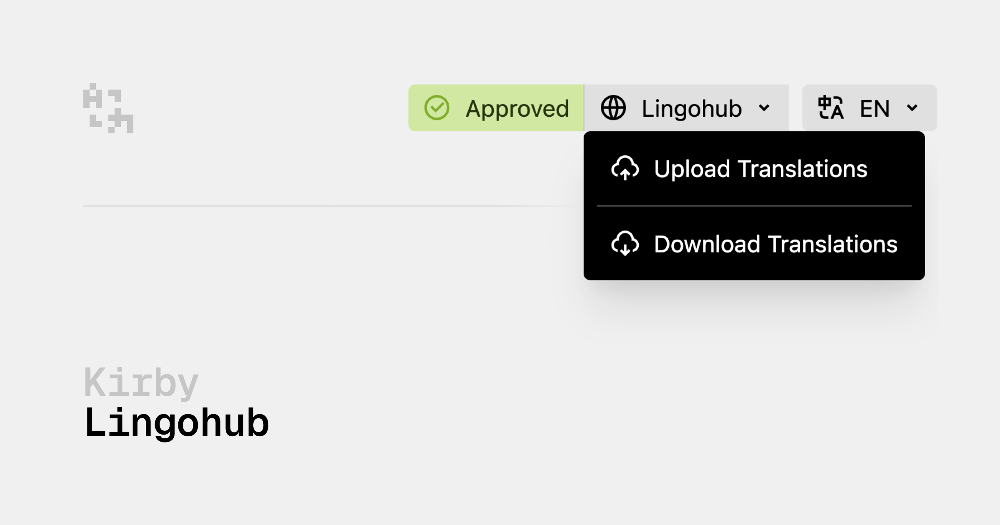

# Kirby Lingohub

The Kirby Lingohub plugin integrates the [Lingohub](https://lingohub.com) translation service into your Kirby website. The plugin allows you to upload content from Kirby to Lingohub for translation and download the translations back to Kirby. It handles the whole serialization and deserialization process, including nested data structures like blocks and structures.

> [!NOTE]
> For this plugin to work, you need to have a Lingohub account and a project set up. You can create a free account at [Lingohub](https://lingohub.com/).

## Requirements

- Kirby 4 or Kirby 5

Kirby is not free software. However, you can try Kirby and the Starterkit on your local machine or on a test server as long as you need to make sure it is the right tool for your next project. … and when you're convinced, [buy your license](https://getkirby.com/buy).

## Installation

### Composer

```bash
composer require johannschopplich/kirby-lingohub
```

### Download

Download and copy this repository to `/site/plugins/kirby-lingohub`.

## Getting Started

### 1️⃣ Kirby Language Configuration

Set up a multi-language Kirby site. For each desired language, create a language file in the `site/languages` folder. The language file should contain the following information:

```php
# /site/languages/en.php
return [
    'code' => 'en',
    'default' => true,
    'direction' => 'ltr',
    'locale' => 'en_US',
    // Or if you need multiple locales:
    // 'locale' => [
    //     'LC_ALL' => 'en_US.UTF-8',
    // ]
    'name' => 'English'
];
```

> [!NOTE]
> Make sure to set the `locale` option to the correct locale for each language. This is important for the mapping between Kirby and Lingohub.

### 2️⃣ Lingohub Setup

First, create a new project in your Lingohub workspace. Use the file format **JSON (Standard)**:


Now, configure the project to use the same source and target languages as you have in Kirby. The language code in Lingohub should match the locale in Kirby. From the example above, the locale in Kirby is `en_US`. Set the language code in Lingohub to `en-US`. (Note the difference in the delimiter.)

As another example: If the Kirby language code is `de` and the locale is `de_DE`, the Lingohub language code should be `de-DE`.

Finally, create an API key for your workspace. Follow the [Linoghub API key guide](https://help.lingohub.com/en/articles/6775959-how-to-create-an-api-key) to create an API key with read/write access.

> [!NOTE]
> Enable full permissions for the **Resources** section in the API key settings. This is required to upload and download translations. No other permissions are needed.

### 3️⃣ Kirby Plugin Configuration

After setting up the languages in Kirby and Lingohub, configure the plugin in the `site/config/config.php` file.

- To retrieve the workspace ID, open the Lingohub dashboard and copy the workspace ID from the URL. If the URL contains `workspace/space_16kPs3bRIpXi-29323/dashboard`, the workspace ID is `space_16kPs3bRIpXi-29323`.
- For the project ID, open the project in Lingohub and copy the project ID from the URL. If the URL contains `project/pr_18JCETCbT9NW-31003/branches`, the project ID is `pr_18JCETCbT9NW-31003`.

```php
# /site/config/config.php
return [
    'languages' => true,

    'johannschopplich.lingohub' => [
        'apiKey' => '<LINGOHUB_API_KEY>',
        'workspaceId' => 'space_123-456',
        'projectId' => 'pr_123-456',
    ]
];
```

### 4️⃣ Blueprint Configuration

Kirby 5 introduces new extensions that allow you to add custom view buttons to most Panel views (e.g. page, site, or file). The Lingohub plugin provides a dropdown button that can be added alongside the default buttons, such as the languages dropdown button.

To add the `lingohub` dropdown button to a particular view, set the `buttons` option in the corresponding blueprint. The following example shows how to reference the default buttons and add the `lingohub` button to a page blueprint:

```yml
title: Note

buttons:
  - preview
  - settings
  # Add the Lingohub button to the page view
  - lingohub
  - languages
  - status
```

> [!NOTE]
> Kirby 4 does not support custom view buttons, but the `lingohub` button has been backported. It is always placed before the language dropdown.

Finalize your blueprints by adding the necessary translation configuration to each field, e.g. `translate: false` if a field should not be translated. The plugin will skip these fields when uploading content to Lingohub.

## Usage

## Translation Status

The [translation status](https://help.lingohub.com/en/articles/6683154-manage-localization-with-statuses) is automatically retrieved from Lingohub and displayed in the user interface. It shows the minimum status of all segments of the page. Only if all segments are in status **Approved**, the translation language will be shown as **Approved** in green color:


Click on the status to open a dialog with more detailed information:


## Upload Translations for a Page or File

Click on the **Lingohub** dropdown button in the Panel header and select **Upload**.


When you click on the button, a dialog will open where you can select the content you want to upload to Lingohub:

- **Source Language**: Select it to upload the default language content to Lingohub. Pre-selected by default.
- **Target Languages**: All languages that have translations for the current page. Pre-selected if there are no translations in Lingohub. This helps you to identify which languages need to be uploaded for the first time, e.g. when migrating an existing Kirby project to Lingohub.

> [!NOTE]
> If no translations are available in Kirby, the **Target Languages** list will be empty.

After selecting the desired languages and confirming the dialog, the plugin will serialize the content and upload it to Lingohub for translation.

## Download Translations from Lingohub

Click on the **Lingohub** dropdown button in the Panel header and select **Download Translations**. This will open a dialog where you can select the languages and status of the translations to download:


The dialog contains the following fields:

- **Status**: Define the minimum status of the segments to download. The default is **Approved**.
- **Languages**: Select the languages to download. By default, all languages with a status of 100% approved in Lingohub are preselected.

Submit the form to download the translations. The page will be updated with the new translations.

## Features

### `translateExternalOnly` Blueprint Field Option

The `translateExternalOnly` option allows you to mark fields that should only be translatable using the external translation service (i.e. Lingohub). For these fields, only the source language is editable. In translations, these fields cannot be edited. Admins can always edit the fields, independent of this setting. Set it to `true` when editors should only edit translations in Lingohub, and when the Lingohub translation memory is important to you.

```yml
fields:
  text:
    label: Text
    type: blocks
    translateExternalOnly: true
```

### Translation Status Table Section


The status section is similar to [Lingohub's statuses overview](https://help.lingohub.com/en/articles/6788499-words-and-segments-overview) and displays the translation status for all available languages. The status section is read-only and cannot be edited.

To add the status section to a blueprint, use the following configuration:

```yml
sections:
  lingohubStatus:
    type: lingohub-status
```

## FAQ

### How Is Kirby Content Data Mapped to Lingohub?

With the JSON (Standard) file format, Lingohub requires a key-value hierarchy structure where all elements in the chain have a long-term consistent key. Thus, nested data structures like `block` fields or `structure` fields in Kirby must be flattened to a key-value map. For example, block fields are transformed into a key-value map where the key is generated from the field name, block type, and block field name: `{fieldName}_{blockId}_{blockType}_{blockFieldName}`.

Lingohub uses a path based approach to identify the content. The path is generated from the Kirby model ID (which doesn't contain any draft status or sort numbers) and the language code.

While Kirby uses a language code as file suffix (e.g., `en`), Lingohub uses a locale code (e.g., `en-US`). The plugin maps the Kirby language code to the Lingohub locale code.

## Roadmap

## Media Files

- Translate all media files (images, videos, etc.) associated with the page. This is a nice-to-have feature that may be implemented in the future.

## Mass Operations

- Upload all pages to Lingohub in bulk, including translations if they already exist.
- Download all pages from Lingohub in bulk. Configure which pages to process using a filter: e.g. only pages with a certain status or language.
- Iterate through all pages in Kirby and check if new translations are available in Lingohub. If so, download them.

## License

[MIT](./LICENSE) License © 2025-PRESENT [Johann Schopplich](https://github.com/johannschopplich)
